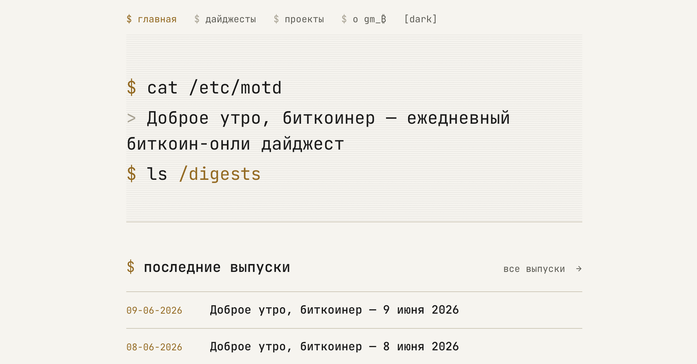

# gm_₿

[](README.en.md)
[](https://github.com/21ideas-org/gm-web/actions/workflows/deploy.yml)
[](https://gm.21ideas.org)
[](LICENSE)



> **Только биткоин, только сигнал — без шума и щиткоинов.**

**gm_₿** — *«Доброе утро, биткоинер»* — ежедневный биткоин-онли дайджест на русском. Каждое
утро — короткая сводка главных событий за прошедшие 24 часа: сеть, майнинг, Lightning,
регулирование, институционалы. Без альткоинов, пампов и шума.

Сайт живёт по адресу [gm.21ideas.org](https://gm.21ideas.org) и входит в экосистему
[21ideas](https://21ideas.org).

Дайджесты пишет **отдельный бот** (его нет в этом репозитории): он создаёт Markdown-файл в
`src/content/digests/`, коммитит и пушит — GitHub Pages пересобирает и публикует сайт, после
чего бот анонсирует ссылку в Telegram/Discord.

## Подписаться

- **Telegram** — [@bitcoin21ideas](https://t.me/bitcoin21ideas)
- **RSS** — [gm.21ideas.org/rss.xml](https://gm.21ideas.org/rss.xml)

## Архитектура

Технологический стек, маршрутизация, генерация OG-карточек и SEO-механика описаны
отдельно — см. [docs/ARCHITECTURE.md](docs/ARCHITECTURE.md).

## Запуск локально

Нужен Node >= 22.12.0 (версия закреплена в `.nvmrc`).

```sh
git clone https://github.com/21ideas-org/gm-web.git
cd gm-web
nvm use            # подхватит версию Node из .nvmrc
npm install
npm run dev        # дев-сервер на localhost:4321
```

## Команды

| Команда           | Действие                          |
| :---------------- | :-------------------------------- |
| `npm install`     | Установить зависимости            |
| `npm run dev`     | Дев-сервер на `localhost:4321`    |
| `npm run build`   | Продакшен-сборка в `./dist/`      |
| `npm run preview` | Предпросмотр собранного сайта     |
| `npm run check`   | Проверка типов (`astro check`)    |

## Контент

### `digests`

Файлы в `src/content/digests/*.md`, по соглашению именуются `YYYY-MM-DD.md`. Frontmatter:

```yaml
title: "Доброе утро, биткоинер — 5 июня 2025"   # идёт в <title>, индекс дайджестов и RSS
description: "<тизер>"         # тизер → RSS + анонс бота в Telegram/Discord
pubDate: 2025-06-05           # дата публикации; OG-обложка датирует новости как pubDate − 1 день
draft: false                  # опционально (по умолчанию false); черновики исключаются при сборке
tags: [сеть, lightning]       # опционально; собираются, но в v1 не отображаются
```

> OG-обложка использует **фиксированный** бренд-заголовок («Доброе утро, биткоинер») и подпись с
> датой, выведенной из `pubDate`; поле `title` на обложку не попадает.

### `projects`

Файлы в `src/content/projects/*.md` наполняют секцию экосистемы 21ideas: `name`, `description`, `status` (`LIVE` | `WIP` | `ARCHIVED`), опционально `url`, `stack`, `featured`, `order`.

## Деплой

Статическая сборка деплоится на GitHub Pages при пуше в `main` (см. `.github/workflows/`), отдаётся с домена из `public/CNAME` (`gm.21ideas.org`).

## Как помочь

Нашли ошибку в дайджесте или на сайте? Откройте issue или pull request. Дайджесты генерирует бот, поэтому правки по содержанию — это фактические уточнения; улучшения самого сайта (вёрстка,
доступность, производительность, SEO) приветствуются в виде PR.

## Лицензия

- **Код** — [MIT](LICENSE).
- **Контент дайджестов** — © проект gm_₿; лицензией на код не покрывается.
